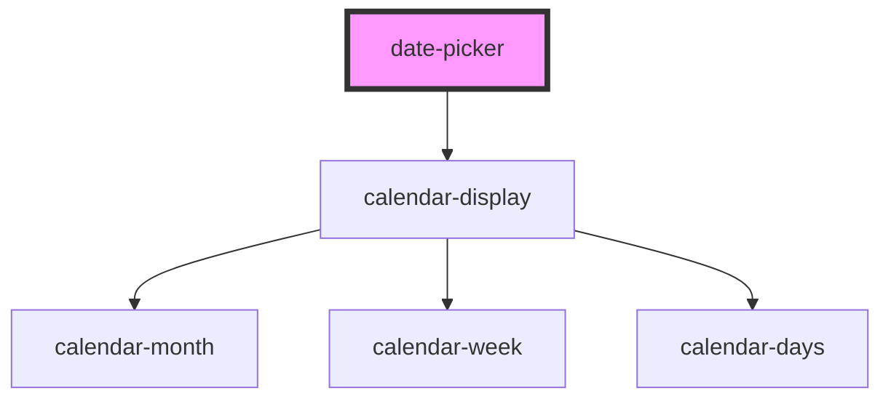

# fintellix-choice

<!-- Auto Generated Below -->

## Properties

| Property      | Attribute     | Description | Type  | Default     |
| ------------- | ------------- | ----------- | ----- | ----------- |
| `currentdate` | `currentdate` |             | `any` | `undefined` |
| `options`     | `options`     |             | `any` | `undefined` |

## Methods

### `getValue() => Promise<string>`

#### Returns

Type: `Promise<string>`

### `setValue(date: any) => Promise<void>`

#### Returns

Type: `Promise<void>`

## Dependencies

### Depends on

- [calendar-display]()

### Graph

----------------------------------------------

*Built with [StencilJS](https://stenciljs.com/)*
